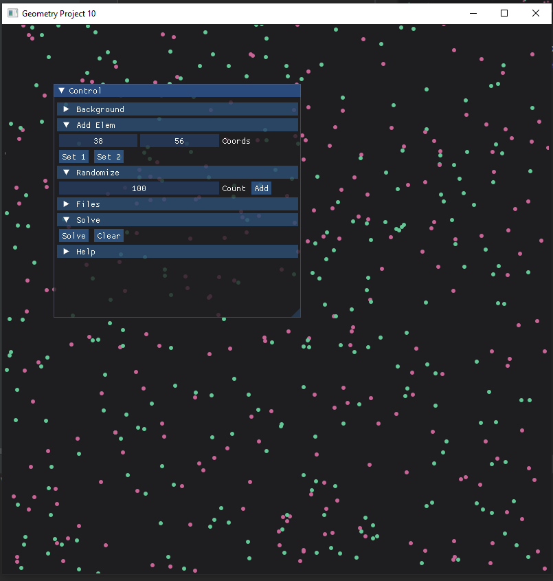

## Шаблон проекта ImGui+SFML

В этом репозитории размещён пример графического приложения на `C++`.



Используемые технологии: `ImGui` и `SFML`. С подробным описанием кода можно
[здесь](https://ege.buran.center/docs/project/cpp2dGeom/intro).


Приложение решает следующую задачу:

> Заданы два множества точек в целочисленном двумерном пространстве.
> Требуется построить пересечение и разность этих множеств.


## Функционал программы

- добавление точек вручную кликом мыши и с помощью полей ввода. 
- добавление заданного количества случайных точек
- сохранение текущего набора точек в файл и загрузка из него
- графическое решение задачи (окраска точек определяется принадлежность к разности или 
пересечению исходных множеств)

Для сохранения и загрузки точек указываются абсолютные пути к файлам:

```cpp
// путь к файлу вывода
static const char OUTPUT_PATH[255] = "D:/Programming/Files/out.txt";
// путь к файлу ввода
static const char INPUT_PATH[255] = "D:/Programming/Files/in.txt";
```