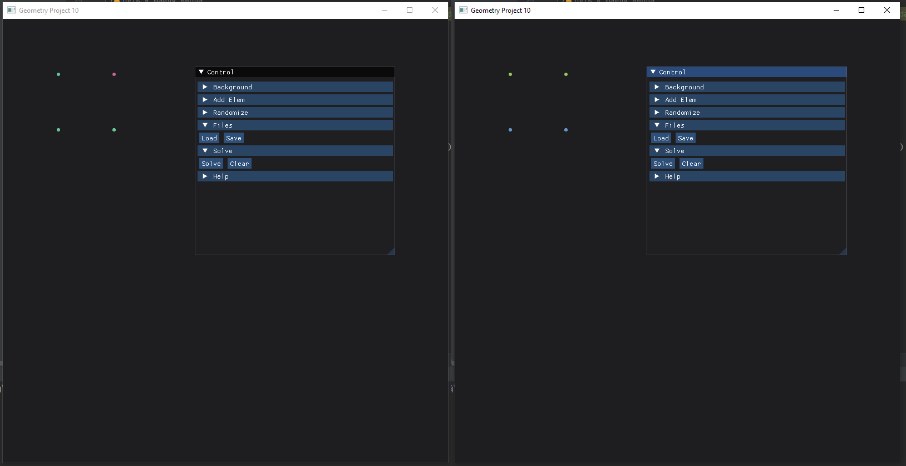

## Шаблон проекта ImGui+SFML

В этом репозитории размещён пример графического приложения на `C++`.


Используемые технологии: `ImGui` и `SFML`. С подробным описанием кода можно ознакомиться
[здесь](https://ege.buran.center/docs/project/cpp2dGeom/intro).


Приложение решает следующую задачу:

> Заданы два множества точек в целочисленном двумерном пространстве.
> Требуется построить пересечение и разность этих множеств.


## Функционал программы

- добавление точек вручную кликом мыши и с помощью полей ввода. 
- добавление заданного количества случайных точек
- сохранение текущего набора точек в файл и загрузка из него
- графическое решение задачи (окраска точек определяется принадлежность к разности или 
пересечению исходных множеств)

Для сохранения и загрузки точек указываются абсолютные пути к файлам:

```cpp
// путь к файлу вывода
static const char OUTPUT_PATH[255] = "D:/Programming/Files/out.txt";
// путь к файлу ввода
static const char INPUT_PATH[255] = "D:/Programming/CppGeometry2d_2/demo-data.txt";
```

## Демо-файл

В демонстрационном файле `demo-data.txt` определено шесть точек. Программа
читает файл построчно, пока не дойдёт до его конца. Три точки содержатся
в первом множестве: (200, 100), (100, 200), (200, 200), и три во втором:
(100, 100), (100, 200), (200, 200)

```
200  100  0
100  200  0
200  200  0
100  100  1
100  200  1
200  200  1
```

Пересечением множеств будут точки: (100, 200), (200, 200), разностью:
(200, 100), (100, 100)

Слева на картинке приведён скриншот программы после загрузки данных,
справа - после решения задачи


